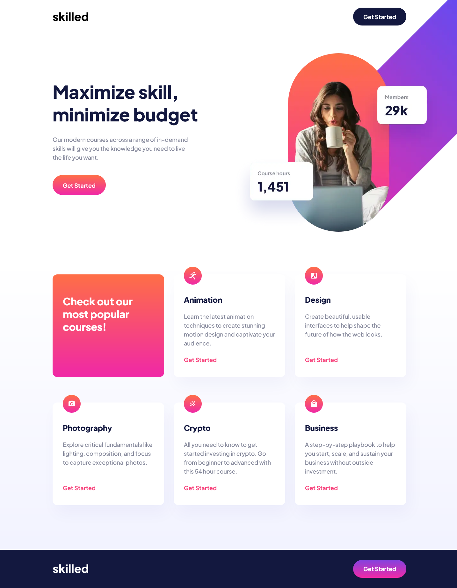

<h1>Skilled e-learning landing page</h1>

  <h3>
    <a href="https://charming-moxie-25efc2.netlify.app/"> Live View </a>
     | 
    <a href="https://www.frontendmentor.io/solutions/skilled-elearning-lp-with-react-ts-uyDZ1GQV9W"> Solution Page </a>
  </h3>

  A challenge on Frontend Mentor.

## 👍 My Challenges:

- Custom components created.
- Responsive image positioning and retina display implemented.
- Getting high rate from [PageSpeed Insights](https://pagespeed.web.dev/report?url=https%3A%2F%2Fsuperlative-gelato-8c62b6.netlify.app%2F)

## 🎉 Build With:

- React + TypeScript
- Semantic HTML5 markup
- Css Grid and Flexbox
- Mobile-first workflow
- CSS custom properties
